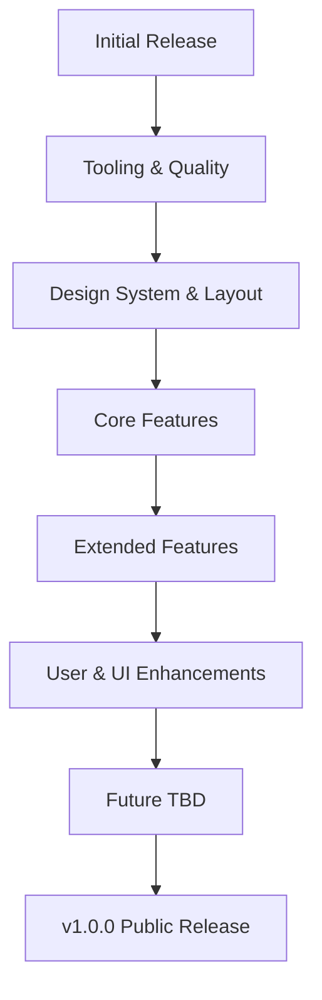

# Bukie Roadmap

This roadmap defines incremental milestones for Bukie, each mapped to a set of actionable issues (e.g., `feat:`, `ci:`, `docs:`). Semantic Release manages versioning for each release.

## Milestones

### Initial Release
* ✅ feat: define initial technical architecture
* ✅ feat: add semantic-release
* ✅ ci: add GitHub Actions workflow for semantic-release

### Tooling & Quality
* ✅ ci: add Biome for linting and formatting
* ✅ ci: add Lefthook for pre-commit hooks
* ✅ ci: add Vitest for unit tests
* ✅ ci: add commitlint for Conventional Commits
* ✅ ci: set up basic Next.js app
* ✅ ci: deploy website to Vercel
* ✅ ci: add Playwright for e2e tests
* ✅ ci: integrate Qlty.sh for code quality, maintainability, and coverage gates

### Design System & Layout
* ✅ feat: custom Storybook setup
* ✅ feat: minimal app shell
* ✅ feat: design tokens in Storybook (Material 3–inspired: 8pt spacing, rem typography, basic color roles)
* ✅ feat: 12‑column grid primitives (Container/Grid/Column) aligned to Material breakpoints + stories
* ✅ docs: design system documentation
* ✅ feat: redesign BookCard to rich, responsive design (genre badge, rating, year) using Vanilla Extract
* ✅ feat: modernize BookList spacing/responsiveness and add optional footer slot to prepare pagination

### API Mocking & Initial Book List
* ✅ feat: mock API for books using MSW or similar
* ✅ feat: seed mock API with 50 sample books
* ✅ feat: fetch and display book data on initial page (no UI/UX yet)
* ✅ feat: implement book card component in Storybook
* ✅ feat: render book cards in grid layout

### Backend API & Database Integration
* ✅ feat: set up backend API routes for books (CRUD)
* ✅ feat: Drizzle + SQLite with migrations, seed scripts, and books CRUD
* ✅ feat: replace mock data with real DB queries
* ✅ feat: update book list UI to load from backend (SSR)
* ✅ test: add basic API endpoint tests (AAA style)
* ✅ docs: document backend API and setup
* ✅ feat(db-postgres): add Postgres client and env-based DB provider selection for preview/prod

### Core Features (DB-backed)
* ✅ feat: item page for books (SSR from backend)
* ✅ feat: redesign Book Details page (tokens, accessibility, SEO metadata)
* ✅ feat: basic search functionality (query DB)
* ✅ feat: search UX polish (styled input, result count, better empty state)
* ✅ fix: search input focus when clicking container/icon
* ✅ feat: homepage sections — New Arrivals, Top Rated, Trending Now (schema + queries + docs)
* ⏳ feat: authentication (Clerk or similar)
* ⏳ feat: add book (CRUD: create, DB-backed)
* ⏳ docs: usage instructions

### Extended Features (DB-backed)
* ⏳ feat: edit and delete book (CRUD: update, delete, DB-backed)
* ✅ feat: improved search and filters (DB queries)
* ✅ feat: pagination for book list (DB queries)
* ⏳ docs: API documentation

### User & UI Enhancements
* ✅ feat(design-system): dark/light mode theming (SSR-safe, no FOUC, accessible toggle)
* ✅ feat(design-system): enhance BookCard UI — reviews count label, optional short description,
    uniform media height across cards, actions row (Add to Library/Preview), polished hover,
    aligned skeleton media height, and normalized section spacing for All Books (see issue #75)
* ⏳ feat: user profiles
* ⏳ feat: UI/UX improvements
* ⏳ docs: onboarding guide

### Future (TBD)
* ⏳ Additional features and improvements will be planned and tracked as issues. Only the first milestones are detailed; more will be added as the project evolves.

### v1.0.0 – Public Release
* docs: finalize documentation
* ci: release and deployment automation
* feat: all core features stable

## 📅 Next Steps
The next milestone is focused on Core Features (DB‑backed):
* Prepare basic search foundation (indexing and DB query shape)
* Start add‑book flow (create endpoint + server-rendered form, DB-backed)

---

## 🧭 Visual Roadmap

