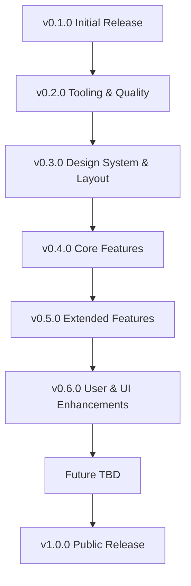

# Bukie Roadmap

This roadmap defines incremental milestones for Bukie, each mapped to a set of actionable issues (e.g., `feat:`, `ci:`, `docs:`). Semantic Release manages versioning for each release.

## Milestones

### v0.1.0 – Initial Release
* feat: define initial technical architecture (#1)
* feat: add semantic-release (#5)
* ci: add GitHub Actions workflow for semantic-release (#6)

### v0.2.0 – Tooling & Quality
* ci: add Biome for linting and formatting
* ci: add Vitest for unit tests (best practice for Remix)
* ci: add Playwright for e2e tests
* ci: add Lefthook for pre-commit hooks
* ci: add commitlint for Conventional Commits
* ci: integrate CodeClimate for coding standards and code quality
* ci: configure all checks (Biome, Vitest, Playwright, commitlint, CodeClimate) in CI pipeline
* docs: document development workflow and code quality standards

### v0.3.0 – Design System & Layout
* feat: custom Storybook setup
* feat: initial layout and navigation
* feat: first UI component
* docs: design system documentation

### v0.4.0 – Core Features
* feat: hello world endpoint (Remix)
* feat: item page for books
* feat: basic search functionality
* feat: authentication (Clerk)
* feat: add book (CRUD: create)
* docs: usage instructions

### v0.5.0 – Extended Features
* feat: edit and delete book (CRUD: update, delete)
* feat: improved search and filters
* feat: pagination for book list
* docs: API documentation

### v0.6.0 – User & UI Enhancements
* feat: user profiles
* feat: UI/UX improvements
* docs: onboarding guide

### Future (TBD)
* Additional features and improvements will be planned and tracked as issues. Only the first milestones are detailed; more will be added as the project evolves.

### v1.0.0 – Public Release
* docs: finalize documentation
* ci: release and deployment automation
* feat: all core features stable

## 📅 Next Steps

The next milestone is focused on tooling and code quality:
* Add Biome for linting and formatting
* Add Vitest for unit tests (best practice for Remix)
* Add Playwright for e2e tests
* Add Lefthook for pre-commit hooks
* Add commitlint for Conventional Commits
* Integrate CodeClimate for coding standards and code quality
* Configure all checks in the CI pipeline
* Document the development workflow

Storybook and design system work will follow in the next milestone. All tasks are tracked as issues in [GitHub Issues](../../issues).

---

## 🧭 Visual Roadmap

