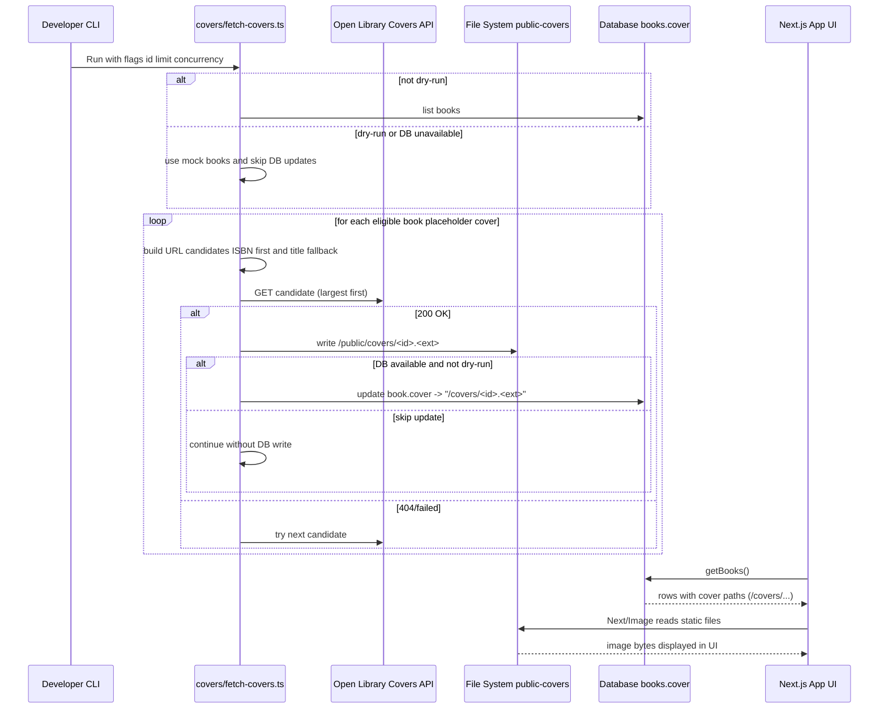
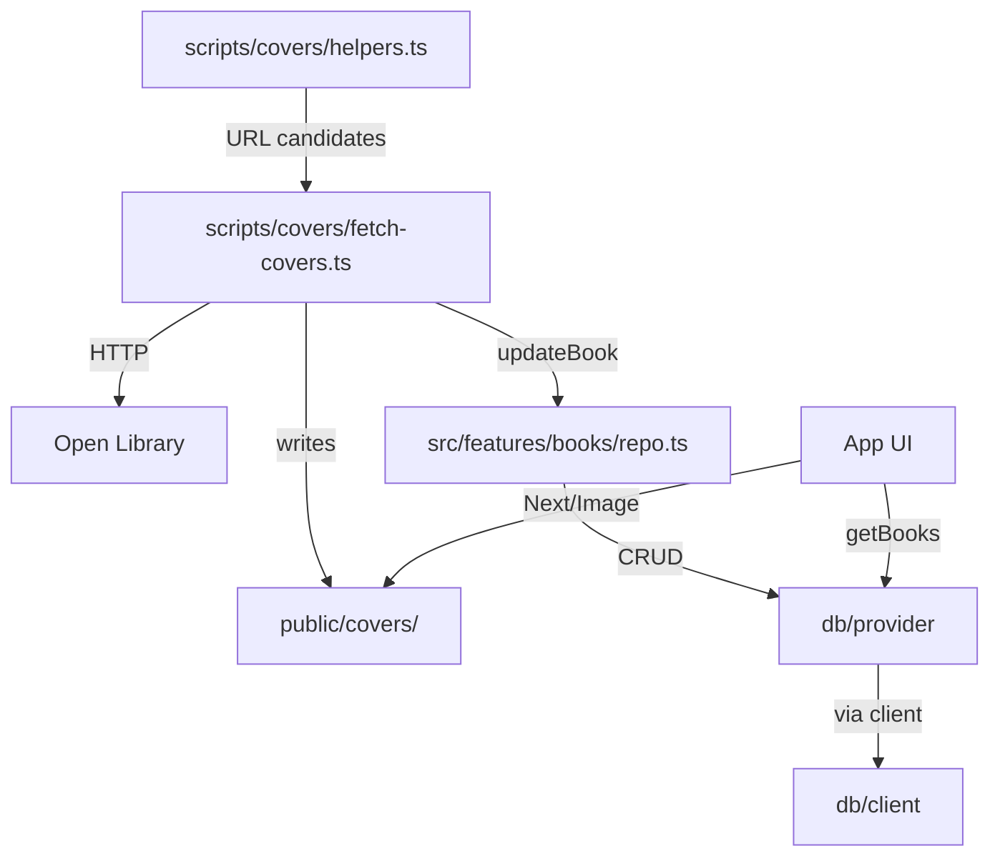

# Cover Fetching Guide

This document explains how book cover images are fetched, stored, and used in the app. 

## Overview

- Goal: replace placeholder covers with real images from Open Library.
- Runner: a small CLI script saves images into `public/covers` and updates the `cover` field in the books table to point to the local file.
- Windows note: use the Node/tsx runner to avoid Bun’s Windows crash.

## Key files

- `scripts/covers/fetch-covers.ts` — main CLI that downloads covers and writes them locally.
- `scripts/covers/helpers.ts` — builds Open Library URL candidates (ISBN first, then title heuristics).
- `mocks/books.ts` — mock data used when DB is unavailable or for `--dry-run`.
- `src/features/books/repo.ts` — `updateBook()` updates the `cover` field after a successful download.
- `public/covers/` — destination folder for downloaded images (served statically by Next.js).

## How it finds covers

Strategy (current):
- Prefer ISBN-based endpoints (largest size first), e.g. `https://covers.openlibrary.org/b/isbn/<ISBN>-L.jpg`.
- If no ISBN, try title-based heuristics (may 404); the script iterates candidates until one succeeds.
- Future: integrate Open Library Search API to resolve cover IDs for higher accuracy.

Image format:
- By default, the script converts images to WebP (`.webp`).
- Use `--no-optimize` to keep the original bytes and file extension (safer on Windows).

## Where covers are stored

- Files are written to `public/covers/<bookId>.<ext>`.
- The book’s `cover` field is set to `/covers/<bookId>.<ext>` so the UI can render it.

## CLI usage

Scripts:
- Windows-friendly runner (Node/tsx): `bun run covers:fetch:node`
- Alternative (Bun): `bun run covers:fetch` (preferred on macOS/Linux/CI)

Flags:
- `--id=<bookId>` — process only one book.
- `--limit=<n>` — process first N eligible books (with placeholder covers).
- `--concurrency=<n>` — number of parallel downloads.
- `--dry-run` — use mock books; do not update the DB.
- `--no-optimize` — do not convert to WebP; write original bytes.
- `--seo-filenames` — name files as `<id>-<title-slug>.<ext>` for SEO-friendly image URLs.
- `--force` — process all books, not just placeholders (overwrites existing covers).

Examples (PowerShell):

```powershell
# Fetch a single book by id (first placeholder in mocks is 39)
+bun run covers:fetch:node -- --id=39 --concurrency=1 --no-optimize

# Fetch the first two placeholder books
+bun run covers:fetch:node -- --limit=2 --concurrency=1 --no-optimize

# Refresh all 50 seeded books using slug filenames (overwrites if found)
bun run covers:fetch:node -- --limit=50 --concurrency=4 --seo-filenames --force
```

## Syncing DB cover paths

After optimizing or re-generating images, you can sync the database to point covers to the best available format:

```powershell
bun run db:sync:covers
```

Behavior:
- Keeps only the first 50 seeded books (ids 1..50); deletes extra rows.
- For each kept book, sets `cover` to `/covers/<id>-<title-slug>.<ext>` using extension precedence:
  - prefers `.webp`, then `.jpg`, then `.png` based on files present under `public/covers`.
- Does not create missing rows; logs any missing ids.

## End-to-end flow



## Component relationships



## Testing the UI

1) Run the fetcher for a known id (e.g., `39`) or a small limit:
   - `bun run covers:fetch:node -- --id=39 --concurrency=1 --no-optimize`
   - `bun run covers:fetch:node -- --limit=2 --concurrency=1 --no-optimize`
2) Start the app: `bun run dev` and open http://localhost:3000
3) Verify the updated book cards show non-placeholder images. Clicking a card shows the new cover on the details page.

## Troubleshooting

- Bun crash on Windows: use `covers:fetch:node` (Node/tsx). This avoids the known Bun segfault.
- “DB unavailable … falling back to mock data”: files are written, but DB isn’t updated. Re-run with the Node runner when your DB is accessible to persist the new cover path.
- No match found: some titles lack predictable cover URLs. Add an ISBN where possible or wait for Search API integration.
