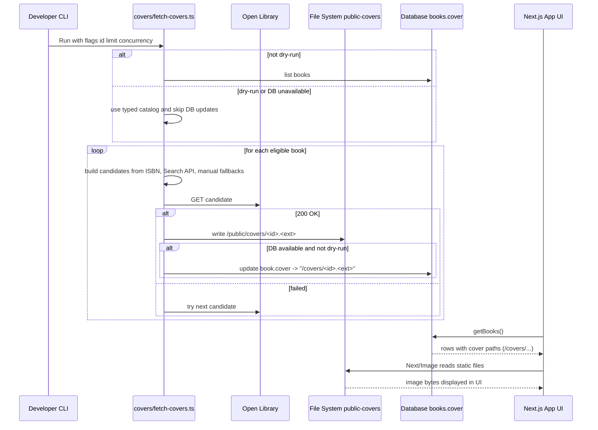

# Cover Fetching Guide

This document explains how book cover images are fetched, stored, and used in the app.

For the end-to-end batch workflow, see `docs/books-steps.md`.

## Overview

- Goal: replace placeholder covers with real images from Open Library.
- Runner: a small CLI script saves images into `public/covers` and updates the `cover` field in the database when DB access is available.
- Catalog-first mode: `--dry-run` uses the typed catalog from `artifacts/catalog/index.ts` and still writes local cover files, which is useful before or independently from DB imports.

## Key files

- `scripts/covers/fetch-covers.ts` - main CLI that downloads covers and writes them locally.
- `scripts/covers/helpers.ts` - builds Open Library URL candidates from ISBNs, Search API results, and a few manual fallbacks.
- `mocks/books.ts` - exports the combined typed catalog used by `--dry-run`.
- `src/features/books/repo.ts` - `updateBook()` updates the `cover` field after a successful download.
- `public/covers/` - destination folder for downloaded images served statically by Next.js.

## How it finds covers

Strategy:
- Prefer ISBN-based endpoints first, e.g. `https://covers.openlibrary.org/b/isbn/<ISBN>-L.jpg`.
- If ISBN lookup is missing or fails, query Open Library Search for cover IDs and edition keys.
- For stubborn titles, use explicit manual candidate IDs in `scripts/covers/helpers.ts`.

Image format:
- By default, the script converts images to WebP (`.webp`).
- Use `--no-optimize` to keep the original bytes and file extension.

## Where covers are stored

- Files are written to `public/covers/<bookId>.<ext>`.
- The book's `cover` field is set to `/covers/<bookId>.<ext>`.
- The placeholder image is `public/covers/placeholder.svg`.

## CLI usage

Script:
- `bun run covers:fetch`

Flags:
- `--id=<bookId>` - process only one book.
- `--limit=<n>` - process the first N eligible books.
- `--concurrency=<n>` - number of parallel downloads.
- `--dry-run` - use the typed catalog and skip DB updates.
- `--no-optimize` - do not convert to WebP; write original bytes.
- `--check-files` - also treat DB rows with missing local files as eligible.
- `--force` - process all books, not just placeholders.

Examples (PowerShell):

```powershell
# Fetch a single book by id
bun run covers:fetch -- --id=c44b0f05-536d-4ce2-a6d5-75a2614ec119 --concurrency=1

# Fetch the first two placeholder books from the DB
bun run covers:fetch -- --limit=2 --concurrency=1

# Fill placeholder covers from the typed catalog without touching the DB
bun run covers:fetch -- --dry-run --concurrency=2

# Refresh a batch and re-download even if a cover already exists
bun run covers:fetch -- --limit=50 --concurrency=4 --force
```

## Syncing DB cover paths

After downloading or optimizing images, you can sync the database to the canonical local paths:

```powershell
bun run db:sync:covers
```

Behavior:
- Keeps only books that still exist in the combined typed catalog.
- For each kept book, sets `cover` to `/covers/<id>.<ext>` using extension precedence:
  - prefers `.webp`, then `.jpg`, then `.png`
- Does not create missing rows; logs any missing ids.

## End-to-end flow


```mermaid
sequenceDiagram
  participant Dev as Developer CLI
  participant Fetcher as covers/fetch-covers.ts
  participant OL as Open Library
  participant FS as File System public-covers
  participant DB as Database books.cover
  participant App as Next.js App UI

  Dev->>Fetcher: Run with flags id limit concurrency
  alt not dry-run
    Fetcher->>DB: list books
  else dry-run or DB unavailable
    Fetcher->>Fetcher: use typed catalog and skip DB updates
  end
  loop for each eligible book
    Fetcher->>Fetcher: build candidates from ISBN, Search API, manual fallbacks
    Fetcher->>OL: GET candidate
    alt 200 OK
      Fetcher->>FS: write /public/covers/<id>.<ext>
      alt DB available and not dry-run
        Fetcher->>DB: update book.cover -> "/covers/<id>.<ext>"
      end
    else failed
      Fetcher->>OL: try next candidate
    end
  end

  App->>DB: getBooks()
  DB-->>App: rows with cover paths (/covers/...)
  App->>FS: Next/Image reads static files
  FS-->>App: image bytes displayed in UI
```

## Testing the UI

1. Run the fetcher for a known id or a small limit:
   - `bun run covers:fetch -- --id=c44b0f05-536d-4ce2-a6d5-75a2614ec119 --concurrency=1`
   - `bun run covers:fetch -- --limit=2 --concurrency=1`
2. Start the app: `bun run dev` and open http://localhost:3000
3. Verify the updated book cards show non-placeholder images.

## Troubleshooting

- `DB unavailable ... falling back to mock data`: files are written, but DB is not updated. Re-run later or use `bun run db:sync:covers` after the DB is ready.
- No match found: add an ISBN if possible or extend `MANUAL_CANDIDATES` / `SEARCH_OVERRIDES` in `scripts/covers/helpers.ts`.
