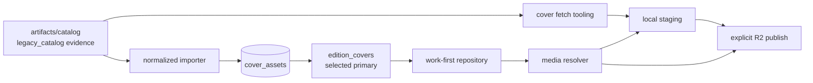

# Covers pipeline: artifact to UI

Contracts:

- Artifact input uses `LegacyCatalogArtifactRecord`; it is not a runtime domain
  type.
- Normalized storage preserves provider-neutral object keys independently of
  work and edition IDs.
- Product reads select an available primary cover from the preferred edition.
- The UI receives a cover object, then resolves its object key through
  `src/media/covers.ts`.
- Missing or unavailable assets resolve to `/covers/placeholder.svg`.

`bun run covers:prune` compares staged files with artifact references.
`bun run covers:cache:hydrate` reconstructs the optional local cache from
private R2. Publishing is always an explicit command and never part of build.
