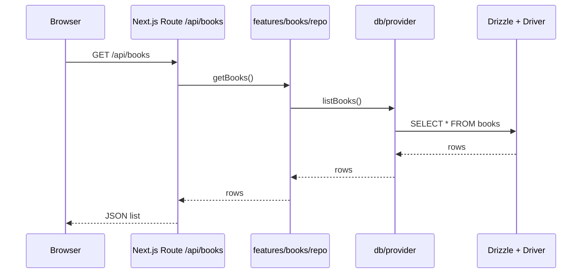
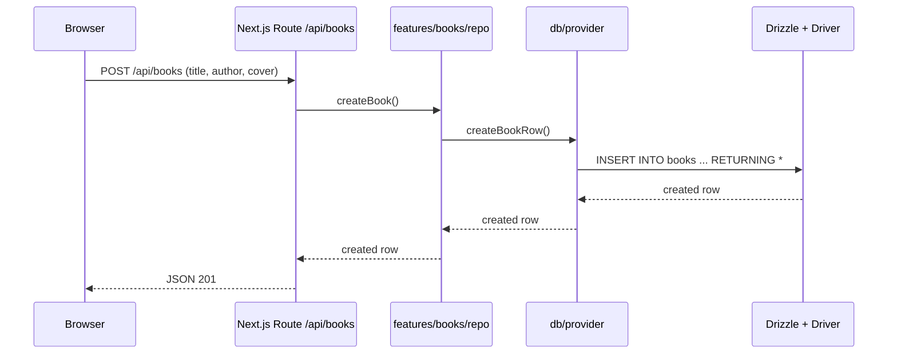
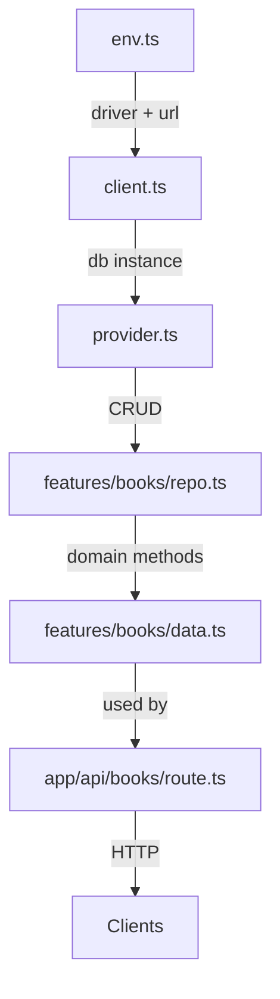

# Database and API Architecture

This document explains how the database layer and API endpoints work in this project, with links to the main files and visual diagrams.

## Overview

- Runtime environments
  - Development: SQLite (local file). Migrations run in-process; seeded with mock data.
  - Preview/Production (Vercel): Postgres (Neon). Migrations run during build using Drizzle migrator.
- Drivers
  - SQLite: better-sqlite3 + drizzle-orm/better-sqlite3
  - Postgres: postgres-js + drizzle-orm/postgres-js
- Env switching
  - `VERCEL_ENV=preview|production` -> Postgres
  - Otherwise SQLite unless a Postgres URL is explicitly present

## Key files

- `src/db/env.ts`: resolves the active driver and Postgres URL
- `src/db/client.ts`: creates the DB client (SQLite or Postgres) and ensures the local dev DB exists/seeded
- `src/db/provider.ts`: CRUD functions implemented with Drizzle
- `src/features/books/data.ts`: high-level data fetch orchestrator
- `src/features/books/repo.ts`: domain-level repo methods invoking provider CRUD
- `src/app/api/books/route.ts`: API route for listing/creating books
- `scripts/db/migrate.pg.ts`: build-time Postgres migrations

## Request flow (read)



## Request flow (write)



## Component relationships



## Environment variables

The app supports these variants for Postgres connection strings (first match wins):

- `DATABASE_URL`
- `DATABASE_URL_UNPOOLED`
- `POSTGRES_URL`
- `POSTGRES_URL_NON_POOLING`
- lowercase variants if injected (e.g., `database_url`)

Set `DEBUG_DB=1` to print which driver and target are used (without secrets) at runtime.

## Migrations

- Postgres migrations run during Vercel build via `bun run db:migrate:pg`.
- SQLite migrations run automatically on first access in development via `ensureDb()`.

## Troubleshooting

- If preview returns an empty list:
  - Confirm that the migration ran successfully in the preview deployment logs.
  - Ensure the Neon integration action "Create database branch for deployment" is ON for Preview.
  - Inspect which DB URL is used by setting `DEBUG_DB=1` in Preview env vars and re-deploy.
  - In Neon console, query the preview branch: `SELECT COUNT(*) FROM books;`.

### Useful endpoints

- `GET /api/debug/db` — returns a safe JSON payload with the active driver and target (host/db, pooled flag or sqlite path). No secrets are returned.
- `POST /api/seed/preview` — seeds the books table in Postgres with mock data. Protected by a simple token:
  - Set `SEED_TOKEN` (server) and `NEXT_PUBLIC_PREVIEW_SEED` (client/runtime) to the same secret value.
  - Call the endpoint only in Preview.
```
