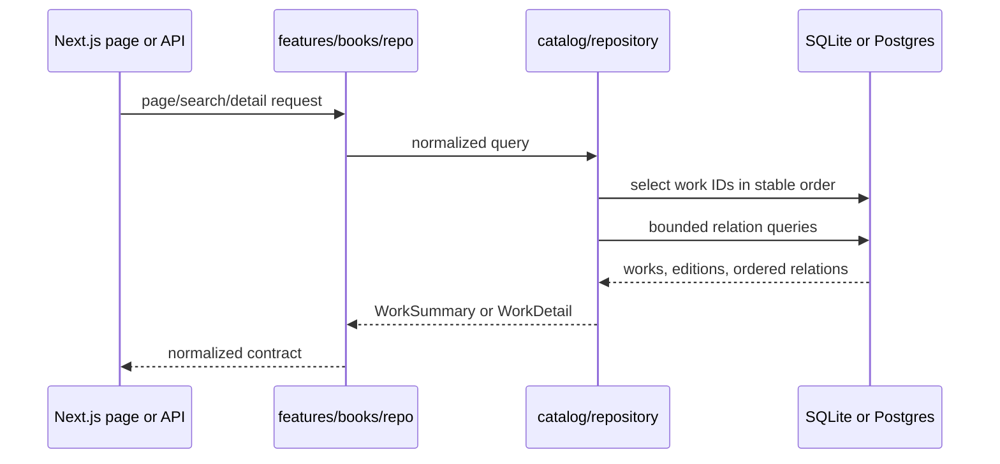

# Database and catalog architecture

Bukie has one runtime catalog model: the normalized work/edition schema defined
by [ADR 0016](./decisions/0016-catalog-metadata-provenance.md).

- SQLite is the local-development provider.
- Postgres is the preview and production provider.
- `src/db/catalog/schema.ts` and `schema.pg.ts` define the same 29 logical
  tables and constraints.
- `src/db/catalog/repository.ts` implements provider-neutral work-first reads.
- `src/features/books/types.ts` defines the public `WorkSummary`,
  `EditionSummary`, and `WorkDetail` contracts.
- `src/features/books/repo.ts` selects the active provider and exposes
  read-only catalog operations.

## Runtime read flow

```mermaid
sequenceDiagram
  participant UI as Next.js page or API
  participant Repo as features/books/repo
  participant Catalog as catalog/repository
  participant DB as SQLite or Postgres

  UI->>Repo: page/search/detail request
  Repo->>Catalog: normalized query
  Catalog->>DB: select work IDs in stable order
  Catalog->>DB: bounded relation queries
  DB-->>Catalog: works, editions, ordered relations
  Catalog-->>Repo: WorkSummary or WorkDetail
  Repo-->>UI: normalized contract
```

Catalog browse and search share the canonical `q`, `category`, `period`, and
`sort` query model in `src/features/books/catalogQuery.ts`. `q` matches selected
work titles and ordered author names. `category` is an active Bukie category
slug. `period` applies one of the documented inclusive/exclusive ranges to the
preferred edition's `publication_sort_date`; works without publication metadata
remain visible unless a period is selected.

The supported deterministic sorts are:

- `title` (default): `(works.sort_title asc, works.id asc)`;
- `added`: `(preferred-edition cataloged_at desc, works.id asc)`;
- `publication`: publication metadata first, then
  `(preferred-edition publication_sort_date desc, works.id asc)`.

Every cursor identifies the complete canonical query context, its sort, and
carries the corresponding sort value plus work ID. Malformed cursors and
cursors for a different search, filter, or sort restart from the first page.
New arrivals use the same catalog-addition semantics. Detail and canonical
`/books/<id>` routes use `works.id`.

Publication periods are `before-1950`, `1950-1999`, `2000-2009`, `2010-2019`,
and `2020-present`. Their boundaries use ISO sort dates, so year-, month-, and
day-precision metadata behave consistently in SQLite and Postgres.

The repository first selects the page of works and then loads preferred
editions, authors, categories, publishers, languages, identifiers, and covers
with bounded follow-up queries. This avoids a Cartesian product and preserves
relationship order.

Detail reads also load current work and edition resolution heads in two bounded
queries. The internal `WorkDetail.provenance` projection exposes the resolution
state and selected evidence needed to enforce display eligibility. It is not
rendered as reader-facing content or returned by the public detail API. Detail
facts are retained only for `present` or `stale`
resolutions backed by an active or appropriately stale selected observation
from an approved, display-permitted, non-synthetic source with an active source
record and entity link. Cover observations use the source's separate asset
display policy; non-cover observations use its metadata display policy.
Missing, conflicting, withdrawn, invalid-observation, inactive-link,
suspended-source, policy-ineligible, and synthetic values remain available to
the audit ledger but are not projected into detail UI, page metadata, or
structured data. A stale bibliographic fact may remain visible with its stored
status and retrieval date as permitted by ADR 0016.

## Enrichment boundary

The [book-detail enrichment benchmark](./research/book-detail-enrichment.md)
defines a nullable, provenance-resolved work first-publication fact. It is
stored as `first_publication_date` plus precision and a derived sort date on
`works`, resolved under `work.first_publication_date`. It is separate from the
preferred edition's publication date and does not change period filters or
publication sorting.

The dedicated resolver promotes one explicitly selected work at a time. It
advances immutable resolution history, the current head, and the three work
projection columns in one transaction. Compatible partial dates select the
greatest supported precision; conflicts and ineligible evidence clear the
projection. Proposed-only enrichment evidence cannot be promoted. Migrations
initialize every existing work projection to null and never copy an edition
date.

All other enrichment continues through source records, immutable observations,
resolution heads, and the existing display-eligibility checks. Dry runs write
to an isolated disposable target and cannot update current heads, projections,
or cover pointers.

Issue #133 adds a description-specific evidence and review layer without
changing that public boundary. Immutable description candidates identify one
of `licensed_verbatim`, `bukie_editorial`, or `model_assisted_candidate` and
retain the class-specific rights, revision, editor, model, prompt, token, cost,
and policy metadata. Relational claim rows map every asserted generated fact to
eligible parent observations. Immutable decision history, a bounded
deduplicated queue, and internal projection history support review,
withdrawal, invalidation, re-review, rollback, and dry-run metrics.

The description projection tables are internal dry-run selections. They are
not `field_resolution_heads`, are not read by the catalog repository, and
never update `works.description`. A selected internal candidate therefore
remains non-public while its source policy is `proposedEvidenceOnly`. The
internal proposal reader also reapplies source, link, observation, parent,
policy, model, and prompt eligibility at read time so a revocation fails closed
before reconciliation runs.

The issue #131
[policy-gated adapter foundation](./catalog-enrichment.md) implements that
isolated proposed-evidence boundary for the versioned five-work diagnostic
manifest. It registers only Bukie editorial and Wikidata work-fact adapters as
enabled, keeps every other researched provider pending, and exposes no current
resolution-head write path. The first-publication resolver remains a separate
explicit promotion boundary and does not turn that diagnostic workflow into a
catalog-wide write path.

## Initialization

`bun run db:init` migrates and idempotently imports the deterministic artifact
into local SQLite. `bun run db:init:pg` does the same for Postgres and is the
database step used by preview/deployment builds.

For an isolated SQLite target, run `bun run db:verify` after initialization.
It checks work and edition counts, artifact provenance links, dangling links,
and confirms that the retired legacy tables are absent.

The importer:

- derives stable target IDs from source keys;
- preserves provider-neutral cover object keys;
- stores each old catalog record ID as a `legacy_catalog` source-record key;
- retains imported and synthetic legacy claims as audit observations;
- never projects synthetic descriptions, ratings, counts, or popularity into
  product reads.

The disposable rebuild workflow remains documented in
[catalog-rebuild.md](./catalog-rebuild.md).

## Legacy-table removal

Historical migrations remain immutable. Forward SQLite and Postgres migrations
remove the old runtime tables only when every populated old catalog row has
active `legacy_catalog` work and edition evidence and normalized projections
are present. A clean database, where the historical table is empty, may proceed
and is populated from the deterministic artifact after migrations.

Do not apply the production cutover during ordinary development. Preview must
first verify the matching application/database pair, and the prior export,
database, and deployment must remain available for rollback.

## API

- `GET /api/books?<catalog-query>` returns `WorkSummary[]`.
- `GET /api/books/page?<catalog-query>&after=<cursor>&limit=<n>` returns a
  normalized work page including the filtered total.
- `GET /api/books/<work-id>` returns reader-facing work detail with internal
  provenance omitted.

Both list routes parse the same canonical catalog query used by the
server-rendered homepage and client-side load-more requests.

Catalog mutation and HTTP seed endpoints were removed. Curated changes must
eventually use the observation/resolution lifecycle rather than direct
projection updates.
