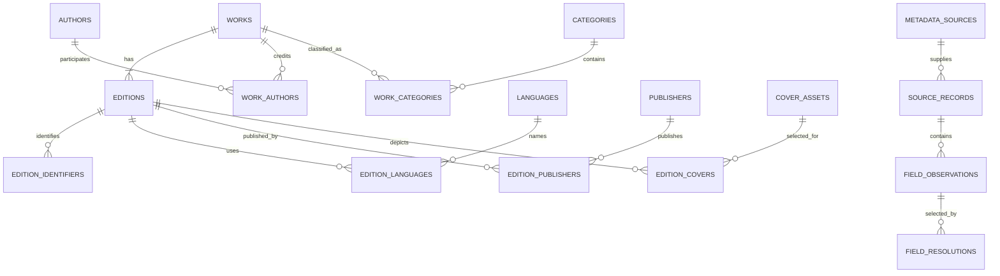

# Catalog Metadata and Provenance Decision

- Status: accepted
- Date: 2026-07-26
- Owners: catalog and discovery
- Related issue: #107

## Context

Bukie's current `books` row mixes work-level facts (title, author, genre and
description), edition-level facts (ISBN, publisher, publication year, pages and
cover), catalog operations (`added_at`) and synthetic discovery signals
(`rating`, `ratings_count` and `book_metrics`). A single text value for author,
genre and ISBN cannot represent common catalog records, and the row does not
record why a value is trusted, when it was retrieved or whether it may still be
displayed.

The current shape is nevertheless a production compatibility contract:

- `books.id` is used by detail URLs, cursor pagination and cover filenames.
- cards and details consume the flat `Book` type during server rendering;
- SQLite is the local-development database and Postgres is used in previews and
  production;
- cover values are provider-neutral `/covers/<id>.<ext>` paths;
- import updates match ISBN first, then normalized title and author;
- current ratings and trending metrics may be synthetic and must not silently
  become trusted catalog facts.

The target model therefore needs bibliographic boundaries and field-level
provenance without breaking current reads or becoming a universal ontology.

## Decision drivers

- Preserve stable detail links, cover keys and SSR behavior during migration.
- Model the work people recognize separately from a publishable edition.
- Represent ordered authors and multiple categories, identifiers, languages,
  publishers, dates and covers.
- Make every displayed imported, curated, derived or synthetic value
  explainable.
- Resolve conflicts deterministically without deleting competing observations.
- Use constraints and query shapes supported consistently by Drizzle, SQLite
  and Postgres.
- Keep ratings policy separate from catalog metadata policy.
- Allow source-specific caching, attribution, refresh and withdrawal rules.

## Considered options

### Keep extending `books`

Adding more scalar or JSON columns would preserve simple reads, but it would
keep work and edition identity ambiguous. Arrays encoded as JSON would be hard
to constrain and index consistently, and field-level provenance would remain
bolted on.

### Store provider payloads and resolve everything at read time

Raw payloads are useful for audit and reprocessing, but provider schemas are
not a stable product contract. Resolving on every SSR request would make
latency, availability and output depend on external sources.

### Normalize catalog entities and retain a small provenance ledger

Normalized work, edition and vocabulary tables provide stable queryable facts.
Source records and field observations retain evidence, while explicit
resolutions materialize the selected values used by SSR. This adds tables and a
resolution step, but it keeps the product model provider-neutral and auditable.

## Decision

Use normalized catalog entities plus a controlled field-observation ledger.

1. A **work** is the abstract intellectual creation users discover.
2. An **edition** is a particular publication of a work. ISBN, publisher,
   publication date, language, page count and cover are edition-scoped.
3. Catalog browse/search returns one result per work and uses a deterministic
   preferred edition for edition-specific display fields.
4. Existing `books.id` values become edition IDs unchanged. New work IDs and
   all other internal entity IDs are generated opaque UUID strings.
5. Existing cover paths remain unchanged and attach to the corresponding
   edition as cover assets.
6. Imported and curated claims are immutable observations. A versioned
   resolution chooses the value projected into product reads.
7. Hot SSR fields and selected relationships are stored in normalized
   relational columns/tables. JSON is limited to source payload snapshots and
   typed observation values; filters do not depend on JSON queries.
8. `books` remains a compatibility surface until all readers and writers have
   migrated. Schema implementation and migration are separate work.

The target relationships are:

## Identity and entity boundaries

### Work

A work owns the preferred title, descriptions, ordered creator credits and
catalog categories. A translation, format, publisher change, pagination change
or revised cover does not by itself create another work. A substantively
different adaptation, abridgement or independently authored revision may be a
different work and must be curated when source identity is ambiguous.

Work grouping is conservative:

- a provider work identifier can support grouping only within that provider;
- a shared ISBN cannot group works because ISBN identifies an edition;
- normalized title/author similarity is a candidate signal, never an automatic
  merge;
- an uncertain match creates a separate work and a review item;
- work merges and splits require an auditable alias/redirect record and must
  not change edition IDs.

### Edition

An edition owns the publication statement: edition title/subtitle, format,
publishers, publication date and precision, languages, page count, identifiers
and covers. Every edition belongs to exactly one work. An edition can lack an
ISBN, publisher, date, page count or cover.

An existing row initially becomes one edition and one work. Rows are not
automatically combined during the first backfill. Later grouping may attach
multiple editions to a work after deterministic identifier evidence or review.

### Author

An author is a credited person or organization. Names are not unique
identifiers. `work_authors` preserves source order and a controlled role such
as `author`, `editor`, `translator` or `illustrator`. At least one primary
creator is preferred, but anonymous and unattributed works are valid.

### Category

A category is a Bukie-owned discovery vocabulary with a stable slug and display
label. Provider subjects remain observations and map through versioned mapping
rules; they do not create public categories automatically. A work may have many
categories and one optional primary category.

### Identifier

Identifiers belong to editions unless a scheme explicitly identifies another
entity. ISBN-10 and ISBN-13 are normalized by removing separators and
uppercasing `X`; display formatting is separate. Valid ISBN values are unique
per scheme across active editions. A collision is a conflict requiring review,
not an automatic overwrite. Provider record keys belong in `source_records`,
not in `edition_identifiers`.

### Publisher and language

An edition may credit multiple publishers in order, with an optional role.
Publisher names are not merged on spelling alone. Languages use normalized
BCP 47 tags where possible, preserve the raw source value in observations, and
allow multiple ordered values.

### Publication date

Publication dates are ISO-like text plus a precision enum: `year`, `month` or
`day`. Examples are `1965`, `1965-06` and `1965-06-01`. A separate derived
`publication_sort_date` uses the first day of an incomplete period and must
never be displayed as more precise than the source.

### Cover asset

A cover asset has a provider-neutral object key, media metadata, lifecycle
state and rights/source policy reference. `edition_covers` supports multiple
ordered covers and one selected primary cover. Existing
`/covers/<books.id>.<ext>` values and objects remain valid because the existing
ID becomes the edition ID.

## Provenance model

### Source and source record

`metadata_sources` describes a source and its operational policy. A source may
be an external provider, a Bukie-curated catalog, a migration, or a derivation
process. `source_records` identifies a specific upstream record/revision and
optionally retains a payload snapshot when policy permits.

Every source policy records:

- stable source key and human-readable name;
- terms and attribution URLs plus the date reviewed;
- whether metadata and assets may be fetched, cached, transformed and
  displayed;
- required attribution text/link and display placement;
- maximum retention or refresh interval, if any;
- deletion/termination behavior;
- allowed access method and request limits;
- payload-storage policy: `none`, `selected_fields` or `full`;
- an approval state. `pending` sources cannot feed public resolutions.

### Field observation

An observation is an immutable claim from one source record about one
controlled field on one target entity. It stores:

- target entity type and ID;
- controlled `field_key`;
- typed JSON value and a normalized comparison hash;
- provenance kind: `curated`, `imported`, `derived` or `synthetic`;
- source record and source field path;
- upstream modified time when supplied;
- retrieval time;
- mapping confidence from `0` to `1`;
- lifecycle state: `active`, `stale`, `withdrawn` or `invalid`;
- optional derivation name/version and parent observation IDs.

Mapping confidence means confidence that Bukie interpreted and matched the
claim correctly. It is not a probability that the underlying fact is true.
Synthetic observations must always carry `synthetic` provenance and may never
win resolution for bibliographic facts outside explicit development fixtures.

### Field resolution

A resolution stores the selected observation for a controlled field, the
resolver version, resolution time and state:

- `present`: one observation is selected;
- `missing`: no eligible observation exists;
- `conflicting`: eligible observations disagree and policy cannot safely pick;
- `stale`: the selected value is past its source/field freshness target;
- `withdrawn`: the previous selection can no longer be used.

The selected value is projected into the owning normalized table or relation
for fast SSR reads. `field_resolutions` is the ownership record for derived
projection fields. Re-running the same resolver version over the same
observations must be idempotent.

### Precedence and conflicts

Precedence is field-specific, not a single global source ranking:

1. an active Bukie-curated correction with a reason wins;
2. otherwise use eligible approved sources in the field policy's configured
   order;
3. prefer a more precise value only when it does not contradict a less precise
   value;
4. use retrieval time only between equivalent claims from the same source;
5. do not use mapping confidence as a hidden tie-breaker for contradictory
   facts;
6. if no safe deterministic choice exists, mark `conflicting` and either show
   the agreed lower-precision value or omit the field.

Curated corrections do not delete imported evidence. They must identify the
editor, reason and replaced resolution for audit. Changing precedence creates a
new resolver version and supports a dry-run diff before promotion.

## Missing, stale, conflicting and withdrawn behavior

| State | Storage behavior | Product behavior | Refresh behavior |
|---|---|---|---|
| Missing | Store no fabricated value; resolution is `missing` when useful for refresh scheduling | Omit the field or show an explicit neutral unavailable state | Retry only according to source schedule; absence is never zero or an empty string |
| Conflicting | Retain all observations and the conflict reason | Show only a non-conflicting lower-precision value, or omit; never pick nondeterministically | Queue review or wait for stronger evidence |
| Stale | Keep the observation and original timestamps | Bibliographic facts may remain visible with `as of` context when policy permits; exclude stale freshness-sensitive signals from ranking | Refresh according to field/source target with backoff |
| Withdrawn | Tombstone the observation/source record; retain only audit material permitted by policy | Immediately resolve to another eligible value or missing; purge display/cache data when required | Do not refetch until the source policy is approved again |
| Invalid | Retain validation reason and raw value only when permitted | Never project or display | Reprocess only after parser/mapping changes |

Null, missing, unknown, not-applicable and withheld are distinct concepts. A
source omitting a field creates no positive claim that the value does not
exist. Empty strings, zero pages, zero dates and placeholder factual copy are
not valid substitutes.

## Data dictionary

Legend:

- **R**: required at steady state
- **O**: optional
- **D**: derived/materialized
- **S**: synthetic values allowed only in marked fixtures
- **P**: selected value or relationship has provenance through a resolution

All timestamps are UTC epoch milliseconds in both databases unless a field is
explicitly an ISO partial date. IDs are opaque text UUIDs.

### Core entities

| Table | Field | Class | Meaning and constraint |
|---|---|---:|---|
| `works` | `id` | R | Internal immutable work ID; primary key |
| | `preferred_title` | R,P | Selected work title; non-empty |
| | `sort_title` | D | Normalized title for ordering, never displayed |
| | `description` | O,P | Selected work-level description |
| | `preferred_edition_id` | O,D | Selected display edition; must belong to this work |
| | `created_at`, `updated_at` | R | Catalog audit timestamps |
| `editions` | `id` | R | Internal immutable edition ID; existing `books.id` is copied exactly |
| | `work_id` | R | Foreign key to `works`; immutable except reviewed work merge/split |
| | `title`, `subtitle` | O,P | Edition-specific title statement when different/useful |
| | `format` | O,P | Controlled format such as hardcover, paperback or ebook |
| | `publication_date` | O,P | ISO partial date text |
| | `publication_precision` | O,D | `year`, `month` or `day`, consistent with date text |
| | `publication_sort_date` | O,D | Full ISO date for sorting only |
| | `pages` | O,P | Positive integer; pagination may legitimately differ by edition |
| | `cataloged_at` | R | Bukie catalog-add timestamp; replaces ambiguous `added_at` naming |
| | `created_at`, `updated_at` | R | Catalog audit timestamps |
| `authors` | `id` | R | Internal immutable author/person/organization ID |
| | `display_name` | R,P | Non-empty selected name |
| | `sort_name` | O,D | Ordering/search value, never used as identity |
| `work_authors` | `work_id`, `author_id` | R,P | Composite relationship |
| | `position` | R,P | Zero-based source/curated display order; unique per work |
| | `role` | R,P | Controlled role; default `author` |
| `categories` | `id` | R | Internal category ID |
| | `slug` | R | Unique stable Bukie-owned URL value |
| | `label` | R,P | Public label |
| | `status` | R | `active` or `retired`; retired slugs redirect |
| `work_categories` | `work_id`, `category_id` | R,P | Unique relationship |
| | `position` | R,P | Stable display order |
| | `is_primary` | R,P | At most one true per work |
| `publishers` | `id` | R | Internal publisher ID |
| | `display_name` | R,P | Non-empty name; spelling alone does not establish identity |
| `edition_publishers` | `edition_id`, `publisher_id` | R,P | Unique relationship |
| | `position`, `role` | R,P | Ordered credit and optional controlled role |
| `languages` | `tag` | R | Normalized BCP 47 tag; primary key |
| | `label` | R,D | Local display label |
| `edition_languages` | `edition_id`, `language_tag` | R,P | Unique relationship |
| | `position` | R,P | Stable order; zero is primary |
| `edition_identifiers` | `id` | R | Internal row ID |
| | `edition_id` | R | Owning edition |
| | `scheme` | R,P | Controlled scheme such as `isbn10` or `isbn13` |
| | `value_normalized` | R,P | Canonical comparison value |
| | `value_display` | O,P | Source/curated display formatting |
| | `is_primary` | R,P | At most one primary identifier per edition |
| `cover_assets` | `id` | R | Internal asset ID |
| | `object_key` | R,P | Unique provider-neutral `/covers/...` value |
| | `media_type`, `width`, `height`, `bytes`, `checksum` | O,P | Verified asset metadata |
| | `state` | R | `available`, `missing`, `withdrawn` or `failed` |
| | `source_policy_id` | O | Policy governing the original asset |
| `edition_covers` | `edition_id`, `cover_asset_id` | R,P | Unique relationship |
| | `position` | R,P | Stable order |
| | `is_primary` | R,P | At most one primary cover per edition |

### Provenance and operational entities

| Table | Field | Class | Meaning and constraint |
|---|---|---:|---|
| `metadata_sources` | `id`, `key`, `name` | R | Internal ID, unique stable key and display name |
| | `terms_url`, `attribution_url`, `reviewed_at` | O | Policy evidence; review date required before approval |
| | `approval_state` | R | `pending`, `approved`, `suspended` or `retired` |
| | `metadata_policy`, `asset_policy`, `payload_policy` | R | Controlled cache/display/transform/retention decisions |
| | `refresh_interval_ms` | O | Minimum source/field refresh target |
| `source_records` | `id`, `source_id`, `record_key` | R | Unique `(source_id, record_key)` |
| | `entity_type`, `entity_id` | R | Matched Bukie target |
| | `source_revision`, `source_modified_at`, `retrieved_at` | O/R | Upstream version/times; retrieval is required |
| | `payload_json`, `payload_hash` | O | Retained only when source policy permits |
| | `state` | R | `active`, `withdrawn`, `deleted` or `unmatched` |
| `field_observations` | `id`, `source_record_id` | R | Immutable observation and evidence record |
| | `entity_type`, `entity_id`, `field_key` | R | Controlled target and field |
| | `value_json`, `comparison_hash` | R | Typed claim and normalized equality hash |
| | `provenance_kind` | R,S | `curated`, `imported`, `derived` or `synthetic` |
| | `source_path`, `retrieved_at`, `source_modified_at` | O/R | Field path and timestamps; retrieval required |
| | `mapping_confidence` | R | Numeric `0..1`, meaning mapping confidence only |
| | `state`, `reason` | R/O | Lifecycle state and explanation |
| | `derivation_name`, `derivation_version`, `parent_ids_json` | O,D | Required together for derived observations |
| `field_resolutions` | `id` | R | Immutable resolution event |
| | `entity_type`, `entity_id`, `field_key` | R | Unique active resolution per target/field |
| | `selected_observation_id` | O | Null for missing/conflicting/withdrawn |
| | `state`, `reason` | R | Resolution state and explainable reason |
| | `resolver_version`, `resolved_at` | R,D | Reproducible policy version and time |
| `entity_aliases` | `entity_type`, `from_id`, `to_id` | O | Audited work/author merge or redirect; IDs never reused |
| | `reason`, `created_at` | R | Review evidence |

### Current-field mapping

| Current `books` field | Target | Backfill rule |
|---|---|---|
| `id` | `editions.id` | Preserve exact text; generate a new `works.id` |
| `title` | `works.preferred_title`; optional `editions.title` observation | Preserve value; do not infer subtitle |
| `author` | `authors` + `work_authors` | Preserve the full string as one author unless structured source data or review can split it safely |
| `genre` | `categories` + `work_categories` | Map only through an explicit Bukie category map |
| `cover` | `cover_assets.object_key` + `edition_covers` | Preserve provider-neutral path and existing object |
| `year` | edition partial date | Convert four digits to `publication_date` with `year` precision |
| `publisher` | `publishers` + `edition_publishers` | Preserve as one publisher; no spelling-based merge |
| `isbn` | `edition_identifiers` | Normalize and validate; invalid values remain invalid observations, not identifiers |
| `pages` | `editions.pages` | Copy only positive integers |
| `description` | `works.description` | Import as a legacy observation; known generic fallback text resolves to missing |
| `added_at` | `editions.cataloged_at` | Preserve epoch milliseconds; it is not publication time |
| `rating`, `ratings_count` | no catalog target | Retain in compatibility storage, mark synthetic where applicable, and defer to ratings architecture |
| `book_metrics` | no catalog target | Retain separately; it is operational/ranking data, not provenance-bearing bibliography |

## Constraints supported by SQLite and Postgres

Use ordinary primary keys, foreign keys, unique indexes, check constraints and
join tables that both databases support. Drizzle definitions for SQLite and
Postgres must express the same logical constraints even where column types
differ.

Required invariants:

- non-empty normalized titles, names, source keys and identifier values;
- exactly one work per edition;
- unique author/category/publisher/language relationship per owner;
- unique relationship positions per owner;
- no more than one primary category per work and one primary cover/identifier
  per edition (enforced with a transaction and, where parity permits, a partial
  unique index);
- globally unique active ISBN value per scheme;
- observation confidence between zero and one;
- selected observations target the same entity/field as their resolution;
- a preferred edition belongs to its work;
- derived observations name their algorithm and version;
- synthetic observations cannot become public bibliographic resolutions.

SQLite foreign keys must be enabled on every connection. Multi-table
resolution and projection changes occur in one transaction. Application-level
checks are required where SQLite and Postgres cannot share an identical
deferred or partial constraint; concurrency tests against Postgres must protect
those checks.

## Required indexes and query shapes

Index names are illustrative, but every implementation must provide equivalent
coverage in both schemas.

| Consumer | Query shape | Required indexes |
|---|---|---|
| SSR catalog cards | page works by deterministic `(sort_title, id)` or catalog order; join preferred edition, ordered authors, primary category and primary cover in bounded follow-up queries | `works(sort_title,id)`, `works(preferred_edition_id)`, relation owner/position indexes, primary-cover/category indexes |
| Book detail | lookup edition ID, join work, all ordered authors/categories, edition languages/publishers/identifiers/covers, then fetch selected provenance summaries | primary keys; `editions(work_id)`, every join table `(owner_id,position)`, `field_resolutions(entity_type,entity_id,field_key)` |
| Search | search selected work title and author display text; return distinct works and preferred editions | normalized title/author indexes initially; Postgres search-specific index may be added without changing semantics |
| Filters | intersect category slug, preferred-edition publication sort date and language; always tie-break with work ID | `categories(slug)`, `work_categories(category_id,work_id)`, `editions(publication_sort_date,work_id)`, `edition_languages(language_tag,edition_id)` |
| Cursor pagination | use every visible sort key plus work ID in the cursor; never paginate by non-unique score alone | composite index matching each supported sort |
| Source refresh | scan approved source records/observations by state and due time, claim bounded batches and resolve affected fields idempotently | `source_records(source_id,state,retrieved_at)`, `field_observations(source_record_id,field_key,state)`, active resolution lookup |
| Rating aggregation | resolve a stable work ID and optional edition ID; rating storage and weights remain outside this ADR | work/edition primary keys and `editions(work_id)` only |

Avoid one join that multiplies authors, categories, identifiers and covers into
a Cartesian product. SSR repositories should fetch a page of work/edition IDs,
then load each ordered relation with bounded `IN` queries and assemble the
domain result. Query-count and duplicate-work tests must protect this shape.

## Import and update lifecycle

1. Register or load an approved source policy.
2. Fetch through the policy's allowed access method and rate limit.
3. Persist the source record/revision and permitted payload in one transaction.
4. Match an edition by a valid unique identifier or a provider record already
   linked to it. Title/author similarity creates a review candidate only.
5. Create immutable field observations; validate and normalize without
   discarding the permitted raw claim.
6. Resolve only fields affected by changed observations using the active
   resolver version.
7. In the same transaction, update selected normalized fields/relations and
   append resolution events.
8. Produce an import report with created, matched, conflicted, invalid,
   withdrawn and unresolved counts.
9. Refresh caches only after commit. A retry of the same source revision must
   not create duplicate observations or change resolved output.

Curated edits use the same lifecycle through an internal curated source and
require an actor, reason and immutable observation. Direct updates to projected
fields are forbidden after cutover.

## Source terms, caching and display

This ADR does not approve any external source. Before a source can feed public
resolutions, its current official terms and usage guidance must be reviewed and
encoded in `metadata_sources`; legal review is required when rights or
derivative use are unclear.

For the source already used by cover tooling:

- its official API guidance describes low-volume, human-facing use, asks
  identified clients to send contact information, recommends caching, and
  directs bulk users to monthly dumps;
- its official licensing page says the operator asserts no new database rights
  while warning that contributed material may still carry existing rights;
- its official cover guidance says not to crawl the covers API, recommends
  direct source URLs for public display, and appreciates attribution links.

These statements are operational inputs, not a blanket grant to copy,
transform, retain or redistribute every field or cover. Before the next
metadata or cover refresh, record separate approved policies for metadata and
assets, including whether Bukie's private object cache and transformed WebP
assets are permitted. If approval is absent or later suspended, keep only
permitted audit identifiers and resolve affected public values/assets to
another eligible source or missing.

Official references:

- https://openlibrary.org/developers/api
- https://openlibrary.org/developers/dumps
- https://openlibrary.org/developers/licensing
- https://openlibrary.org/dev/docs/api/covers

## Staged migration, rehearsal and rollback

Schema implementation must be delivered separately and rehearsed on disposable
copies of both the SQLite catalog and a Postgres preview branch.

### Stage 0: baseline and fixtures

- Record row counts, null/invalid counts, duplicate normalized ISBNs, current
  UUIDs, cover paths and representative SSR query output.
- Freeze at least the representative cases below as migration fixtures.
- Add logical target schemas for both databases and compare generated SQL.
- Do not change application reads or writes.

Rollback: none required; no data changes.

### Stage 1: additive schema

- Create source/provenance, work, edition, vocabulary and relationship tables.
- Add constraints and indexes without modifying `books`.
- Register internal `legacy_catalog`, curated and derivation sources.

Rollback: drop only the new empty tables after verifying `books` is untouched.

### Stage 2: idempotent backfill

- For each `books` row, preserve its ID as an edition, create one work, map
  valid values using the current-field table and create legacy observations.
- Store a backfill version and source-row hash so reruns skip unchanged rows.
- Do not group works heuristically.
- Compare counts, IDs, cover paths and flat compatibility output.

Rollback: application still reads `books`; truncate/drop only versioned target
rows from the failed backfill. Keep the generated report.

### Stage 3: dual-write and shadow-read

- Change importer/admin writes to write normalized/provenance data and the
  legacy compatibility row in one transaction.
- Build the target flat read model behind a feature flag and compare it with
  current SSR output in tests and preview logs with no personal/source payload
  data.
- Repair differences before enabling target reads.

Rollback: disable shadow reads and return to legacy writes only. Replay the
normalized change log into `books` before disabling dual-write if any accepted
write was not projected.

### Stage 4: read cutover

- Switch repositories to target queries while returning a backwards-compatible
  `Book` shape.
- Preserve `/books/<existing-id>`, cursor semantics until a separately versioned
  cursor change, and cover paths.
- Keep `books` as a verified compatibility table/projection and keep dual-write
  enabled for at least one release.

Rollback: flip the read flag to `books`; do not reverse migrations. Validate
that dual-write parity is current before rollback.

### Stage 5: compatibility retirement

- Migrate API/domain types to an edition-aware result.
- Stop legacy writes only after parity, backup and rollback-window checks pass.
- Removing or replacing `books`, changing URLs, or regrouping works requires a
  separate issue and migration.

Rollback: restore from the pre-retirement backup or recreate `books` from the
versioned projection. This stage must not ship in the initial schema PR.

Rehearsal gates for both databases:

- zero lost/changed edition IDs and cover paths;
- input/output counts reconcile, with every rejected field explained;
- the backfill is idempotent on a second run;
- flat card/detail projections match expected fixtures;
- query plans use the intended indexes at catalog-scale and at a 10x fixture;
- forced failure mid-batch leaves no partial entity/resolution projection;
- rollback to the legacy read path requires no data restore through stage 4.

## Representative-record exercise

These fixtures exercise identity, cardinality and failure policy. Names and
values are intentionally illustrative rather than production catalog claims.

| Case | Input shape | Expected target/result |
|---:|---|---|
| 1 | One author, category, valid ISBN-13 and cover | One work/edition; ordered relations; existing ID and cover path preserved |
| 2 | Two ordered authors with distinct source IDs | Two authors at positions 0/1; no joined author string as identity |
| 3 | Three categories, one mapped as primary | Three work-category rows; exactly one primary |
| 4 | Hardcover and translated paperback for one verified work | One work, two editions with independent language, publisher, date, pages, ISBN and cover |
| 5 | Edition has no ISBN but has a provider edition key | Edition remains valid; provider key stays in `source_records`; no fake identifier |
| 6 | Sources claim `1965` and `1965-06-01` | Select day precision when policies consider claims compatible; display exact selected precision |
| 7 | Approved sources claim incompatible publication years | Mark field conflicting; show no exact date until resolved |
| 8 | Title/author match but identifiers prove separate editions of uncertain works | Do not auto-merge works; create a review candidate |
| 9 | Source omits publisher, pages and cover | Store no empty observations; fields/covers resolve missing and UI collapses them |
| 10 | Selected description becomes stale | Keep value only if policy permits, expose freshness context, schedule refresh |
| 11 | Selected cover/source record is withdrawn | Tombstone evidence as permitted, purge cached asset if required, choose next eligible cover or placeholder |
| 12 | Legacy row contains generated rating/count and generic description fallback | Rating remains outside catalog target and marked synthetic; generic description resolves missing |

Together the cases contain 14 representative edition input records: cases 4
and 8 each contain two, and the other cases contain one. They resolve to 13
works because the two case-4 editions share one verified work while the case-8
records remain separate.

Walk-through invariants:

- list/card queries return 13 distinct works for the 14 input editions;
- detail lookup by either case-4 edition ID returns the same work and the
  selected edition-specific facts;
- category and language filters do not duplicate the work;
- a refresh retry creates no duplicate observation or changed resolution;
- withdrawing a source never turns absence into zero, an empty string or a
  fabricated fallback.

## Automated-test contract for implementation slices

### Unit and database integration

- ISBN normalization/validation and collision handling;
- partial-date parsing, precision and sort-date derivation;
- conservative work/edition matching and no title-only merges;
- ordered multi-author/category/language/publisher relationships;
- deterministic field resolution for present, missing, compatible,
  conflicting, stale, invalid and withdrawn observations;
- curated precedence, resolver versioning and idempotent retries;
- synthetic values cannot win public bibliographic resolution;
- SQLite/Postgres constraint and query-semantic parity;
- backfill stability for IDs, cover paths, source hashes and a second run;
- transaction rollback on a failed projection update;
- flat compatibility projection for full and partial records;
- cursor tie-breaks and no duplicate works across pages.

### Playwright

- SSR catalog and detail navigation preserve every existing edition URL;
- multiple authors/categories render in defined order once the edition-aware UI
  slice exists;
- missing ISBN, publisher, date, description and cover do not produce invented
  facts or broken layout;
- a work with multiple editions appears once in discovery and each edition
  detail remains reachable;
- category/language/publication filters remain shareable and do not duplicate
  results once #110 is implemented;
- provenance/freshness disclosure is keyboard accessible when a UI slice adds
  it.

This documentation-only decision changes no executable behavior, so no new
unit or Playwright tests are added in this PR. Each implementation slice must
add the applicable tests above before changing production behavior.

## Follow-up implementation slices

The design can be implemented without reopening identity or provenance
decisions in these dependency-ordered slices:

1. Add parity target schemas, constraints and migration fixtures for SQLite and
   Postgres.
2. Implement versioned legacy backfill, reconciliation report and rollback
   rehearsal.
3. Implement source policies, observations and deterministic resolution with
   curated/imported lifecycle tests.
4. Add target repositories, dual-write/shadow-read parity and compatibility
   projection.
5. Cut catalog reads over behind a rollback flag.
6. Adopt edition-aware domain/UI contracts in #108, #110, #109 and #112.
7. Attach ratings observations/aggregates to stable work/edition IDs only after
   the separate ratings architecture and identity dependencies are complete.

Each slice needs its own issue and closing PR. This ADR does not create those
issues or authorize schema/UI work.

## Consequences

### Positive

- Work and edition identity become explicit without breaking existing links.
- Multiple values are normalized, ordered, constrained and queryable.
- Displayed metadata can explain source, freshness and conflict state.
- Source withdrawal and policy changes have a defined safe path.
- Catalog, discovery and ratings work share stable identity boundaries.

### Costs and risks

- More tables and bounded relation-loading queries replace one simple row.
- Import becomes a staged match/observe/resolve/project lifecycle.
- SQLite/Postgres parity needs deliberate integration coverage.
- Initial one-row/one-work backfill may temporarily preserve duplicate works
  until evidence or review safely groups them.
- Source policy requires recurring review rather than a one-time assumption.

## References

- [Database decision](./0010-database.md)
- [Image storage decision](./0015-image-storage.md)
- [Database and API architecture](../database-architecture.md)
- [Database section logic](../database-sections.md)
- [Book curation and import](../books-steps.md)
- `src/db/schema.ts`
- `src/db/schema.pg.ts`
- `src/db/provider.ts`
- `src/features/books/types.ts`
