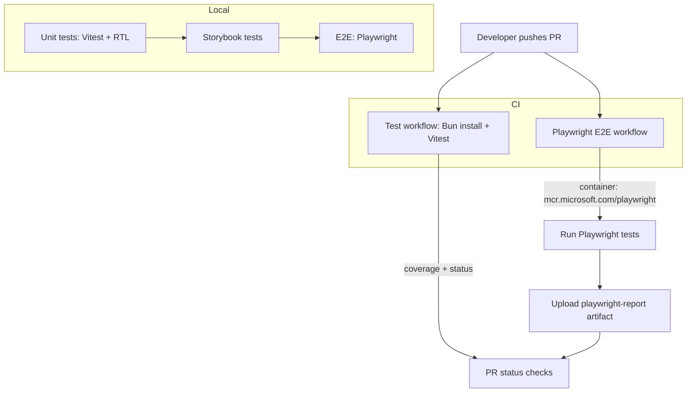

# Testing Guide

This project uses a layered testing strategy to keep confidence high while staying fast and maintainable.

- Unit tests: Vitest + React Testing Library for pure logic and component behaviors.
- Storybook tests: Vitest running against Storybook stories for visual states to render without errors.
- E2E tests: Playwright for critical user journeys in a real browser.
- CI: GitHub Actions run unit tests on every PR and E2E on the Playwright workflow.

## Unit testing (Vitest)

- Config: `vitest.config.unit.ts`
- Runner: Bun (`bun run test`)
- Environment: `jsdom`
- Setup: `vitest.setup.ts` starts MSW for HTTP mocking

Conventions
- Test files live next to source files and are named `*.test.ts(x)` or `*.spec.ts(x)`.
- Follow AAA (Arrange – Act – Assert), one behavior per test.
- Prefer pure functions and component logic that can be rendered without external I/O.

Coverage
- Coverage is collected with V8 and limited to `src/**/*.{ts,tsx}`.
- Build/config/test scaffolding is excluded so coverage reflects actual runtime code, not tools.

Run locally
- All unit tests: `bun run test`
- With UI (watch): `bunx vitest --config vitest.config.unit.ts --ui`

## Storybook tests

- Config: `vitest.config.storybook.ts`
- Run: `bun run test:storybook`
- Goal: ensure each story renders deterministically and key states are visible.

## E2E testing (Playwright)

- Config: `playwright.config.ts`
- Run locally: `bun run test:playwright`
- The config can launch the Next.js app automatically unless `PLAYWRIGHT_BASE_URL` is provided.

Keep E2E focused on:
- Happy paths for core journeys (home page loads, key navigation, search submit, etc.).
- Avoid flakiness—stub network only when needed or seed predictable data via fixtures.

## What not to test

- Tooling and build/config files (e.g., Next/Playwright/Vitest configs, Drizzle config) are excluded from coverage.
- These files are executed by tools, not by your application at runtime.

## GitHub Actions integration

- `Test` workflow: runs unit tests on PRs.
- `Playwright E2E Tests` workflow: runs E2E in a Playwright container on PRs and publishes the HTML report.

## Test flow



## Quick tips

- Keep tests small, deterministic, and independent.
- Use MSW for network requests in unit tests.
- Prefer testing outputs/DOM over implementation details.

## References

- See ADRs in `docs/decisions` for the testing and tooling rationale.
- See `README.md` for CI and database notes.

## Test-time DB mock and local DB helper

- To avoid unit tests writing to the local dev SQLite file (`.data/dev.sqlite`), the test setup (`vitest.setup.ts`) applies a test-time mock for the DB provider that replaces create/update/delete with an in-memory implementation.
  - `createBookRow` returns a synthetic id and tracks it in-process.
  - `updateBookRow` and `deleteBookRow` simulate not-found for ids not created during the same test process.

- A lightweight helper `scripts/db/list-books.ts` is available for local inspection of `.data/dev.sqlite`. Run it via:

```powershell
bun run db:list
```

- If you need tests to run against a real DB for integration verification, set the env var `TEST_USE_REAL_DB=1` before running tests and the provider mock will be skipped (see `vitest.setup.ts`). Example:

```powershell
$env:TEST_USE_REAL_DB=1; bun run test
```

This approach keeps unit tests fast and side-effect free while allowing teams to opt into a real-DB integration run when needed.
